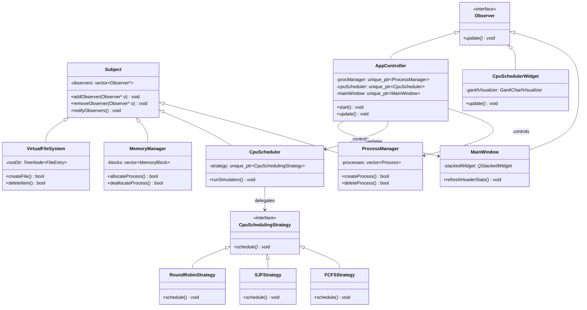
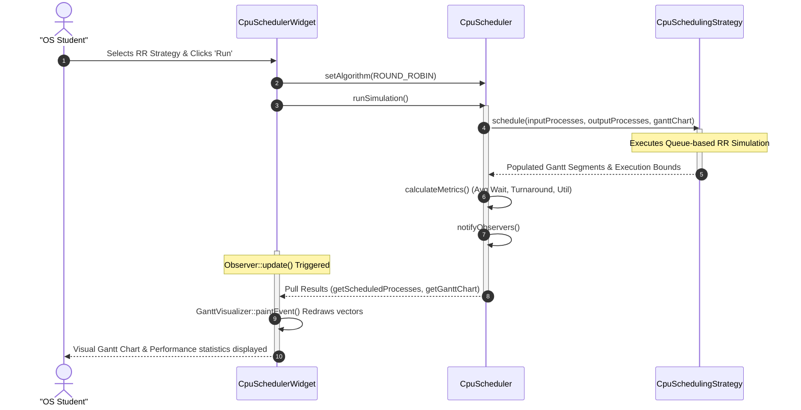

# Mini Operating System Simulator

An interactive, desktop-based Operating Systems simulation tool developed in **C++** utilizing the **Qt 6 Framework**. The project provides real-time visualizations, performance metrics, and academic explanations for core operating system algorithms.

---

## Technical Highlights

*   **Architecture:** Model-View-Controller (MVC) design separating simulation state, custom rendering viewports, and application coordinators.
*   **Design Patterns:**
    *   **Strategy Pattern:** Interchanging algorithm policies dynamically (e.g., Scheduling, Partitioning, Replacement).
    *   **Observer Pattern:** Custom Subject-Observer structures notifying view canvasses of model changes.
    *   **Singleton Pattern:** Thread-safe `SystemConfig` manager driving Light and Dark style states dynamically.
    *   **Factory Pattern:** Polymorphic strategy creation via static factory classes.
*   **Custom Data Structures:** Custom template classes for `Queue` (circular/linked list), `Stack` (linked list), `LinkedList` (doubly-linked), `Tree` (multi-way tree for VFS directory hierarchy), and `Graph` (cycle-detecting directed graph for deadlock detection).
*   **Theme Engine:** Real-time toggling between academic Light Mode and neon Slate-Blue Dark Mode.

---

## File Structure

```
mini_os_simulator/
├── CMakeLists.txt
├── README.md
├── docs/
│   ├── UserManual.md
│   └── TestCases.md
└── src/
    ├── main.cpp
    ├── common/
    │   ├── DataStructures.h
    │   ├── Observer.h
    │   ├── Subject.h
    │   ├── Singleton.h
    │   ├── SystemConfig.h
    │   └── SystemConfig.cpp
    ├── model/
    │   ├── Process.h
    │   ├── ProcessManager.h
    │   ├── ProcessManager.cpp
    │   ├── CpuScheduler.h
    │   ├── CpuScheduler.cpp
    │   ├── MemoryManager.h
    │   ├── MemoryManager.cpp
    │   ├── PageReplacer.h
    │   ├── PageReplacer.cpp
    │   ├── DeadlockDetector.h
    │   ├── DeadlockDetector.cpp
    │   ├── DiskScheduler.h
    │   ├── DiskScheduler.cpp
    │   ├── VirtualFileSystem.h
    │   └── VirtualFileSystem.cpp
    ├── view/
    │   ├── MainWindow.h
    │   ├── MainWindow.cpp
    │   ├── ModuleWidgets.h
    │   └── ModuleWidgets.cpp
    └── controller/
        ├── AppController.h
        └── AppController.cpp
```

---

## UML Diagrams

### 1. Use Case Diagram
```mermaid
left_to_right_direction
actor User as "OS Presenter / Student"

rectangle "Mini OS Simulator" {
    usecase UC1 as "Manage & Trace Processes"
    usecase UC2 as "Simulate CPU Scheduling (FCFS, SJF, RR, Priority)"
    usecase UC3 as "Manage Memory Allocation (Fixed/Dynamic)"
    usecase UC4 as "Analyze Page Faults (FIFO, LRU, Optimal)"
    usecase UC5 as "Detect Deadlocks (Banker's & Graph Cycles)"
    usecase UC6 as "Analyze Disk Seeking (SCAN, SSTF, etc.)"
    usecase UC7 as "Navigate Virtual File System"
    usecase UC8 as "Aggregate System Analytics"
}

User --> UC1
User --> UC2
User --> UC3
User --> UC4
User --> UC5
User --> UC6
User --> UC7
User --> UC8
```

### 2. Class Diagram (MVC Architecture)


### 3. Sequence Diagram (CPU Scheduling Simulation Execution)


---

## Build and Compilation Guidelines

### Prerequisites
*   **CMake:** VERSION 3.16 or higher.
*   **C++ Compiler:** Supporting C++17 standard (GCC 9+, Clang 10+, or MSVC 2019+).
*   **Qt Framework:** Version 6.0 or higher (specifically Core, Gui, and Widgets modules).

### Compiling on Windows/Linux (Command Line)
1.  Navigate to the project directory:
    ```bash
    cd mini_os_simulator
    ```
2.  Create a build directory and enter it:
    ```bash
    mkdir build
    cd build
    ```
3.  Generate build files with CMake:
    ```bash
    cmake ..
    ```
4.  Compile the project:
    *   **Windows (MSVC):**
        ```bash
        cmake --build . --config Release
        ```
    *   **Linux/macOS:**
        ```bash
        make -j$(nproc)
        ```
5.  Run the executable:
    *   **Windows:** `.\Release\MiniOSSimulator.exe`
    *   **Linux:** `./MiniOSSimulator`

### Compiling in Qt Creator (Recommended)
1.  Open **Qt Creator**.
2.  Select **Open File or Project** and choose the `CMakeLists.txt` file in the root folder.
3.  Configure the project kit (choose **Qt 6 Desktop Kit** matching your compiler).
4.  Click **Build** (hammer icon) and then **Run** (green play button).
